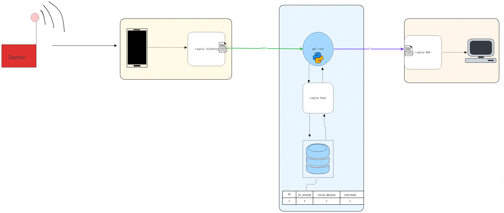

# Sprint 0 Proyecto Biometria y Medio Ambiente

Repositorio correspondiente al Sprint 0 del proyecto de Biometría y Medio Ambiente.
Este proyecto integra sensores BLE (beacons), una aplicación Android, una API REST con base de datos y una interfaz web para visualizar las mediciones  recogidas.

# Arquitectura del Proyecto 



# Tecnologias utilizadas y Dependencias

* Arduino (C++)
* Android Studio (Java)
* Python
  * Fast API
  * Pydantic
  * Pytest
  * SQLITE3
* JavaScript
* HTML
* CSS
* SQL

## Dependencias Python

Aparte de tener el resto de tecnologias utlizadas, para la API y los tests es necesario tener instalado las librerias de Python mencionados anteriormente. Lo siguiente es un comando para instalarlas
```

pip install fastapi[standard]
#sqlite 3 viene con python.
pip install pydantic 
pip install pytest

``` 


# Estructura de Carpetas del Repositorio

```
Sprint0_ProyectoBiometria
|
|---doc # Aqui va la documentacion del proyecto.
|
|---src 
|    |---arduino # Codigo que ejecuta el sensor para publicar beacons.
|    |---android  # codigo de la app que recibe y guarda la info de los beacons.
|    |---server
|       |---API # Contiene main.py que ejecuta el codigo de la API.
|       |---bbd # Base de datos y la Logica de Negocio
|    |---web # Pagina web donde tiene una interfaz para ver los datos de la bbd.
|       |---css
        |---js # contiene la Logica Fake de la web + el script que carga las mediciones.
|
|---test # Aqui estan los tests de la API y Logica.

```

# ¿Como Ejecutar Este Repositiorio?

Para probar  esta repo debe hacer lo siguiente:
1. **Levantar el Servidor (API y WEB)**
> ⚠️ **Advertencia**
> El servidor está hosteado localmente, así que es importante que sepa su IP local para acceder a la web.  
> Si no sabe cuál es su IP local, puede ejecutar en la terminal:  
> ```bash
> ipconfig
> ```
> Además, recuerde cambiar las URLs de la API en el código JavaScript de la web y en el código Java de la app Android.


Este es el primer paso para que la app pueda guardar le medición sin problema. Para levantar el server ejecute lo siguiente:
```
cd src/server
fastapi dev API/main.py --host 0.0.0.0 --port 8000
```
1. **Ejecutar codigo del sensor**
   * Carga y ejecuta el programa HolaMundoBeacon que se encuentra dentro de la carpeta ```arduino/```.
2. **Abrir la app de Android**
   * Recuerde tener el bluetooth y ubicación encendido.
   * Una vez abra la app, presione el boton de buscar nuestro dispositvo y luego al boton de guardar medición.
  
3. **Acceder a la web**
Para acceder a la web debe poner en el navegador: ```http/{ip_local}:8000/```.

## Ejecutar los Tests
Ejecutar los test es sencillo, solo tienes situarse en el directorio test y luego ejecutar ```pytest {nombre_del_archivo}```.

Por ejemplo:
```
cd test
pytest api_tests.py
```